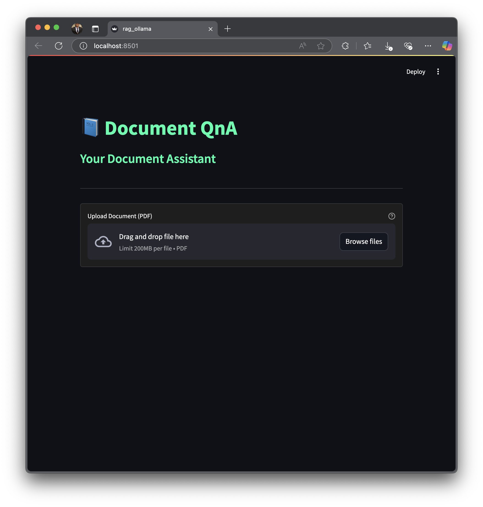
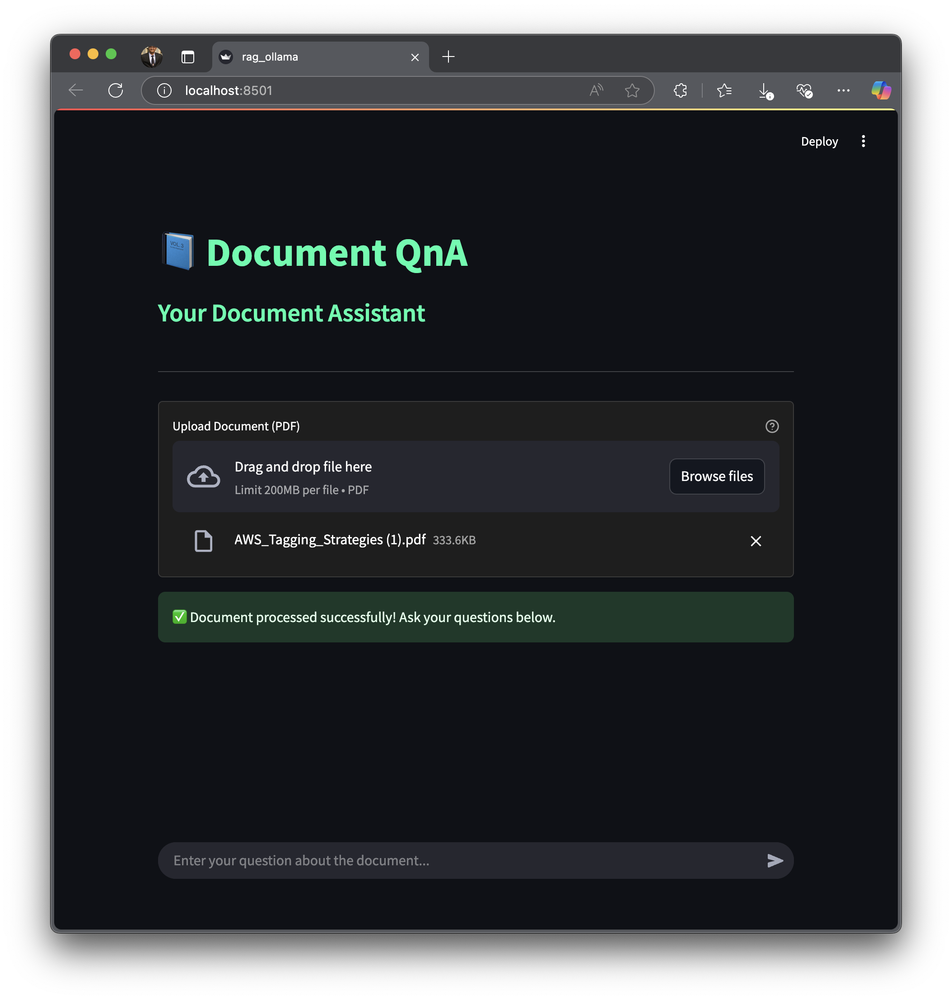
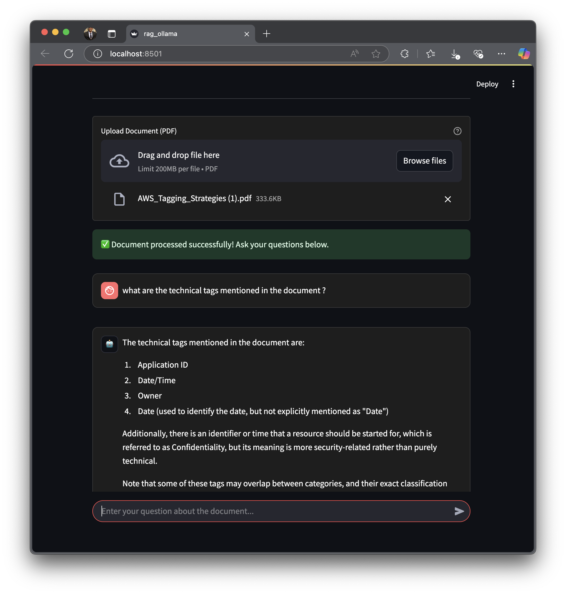

# 🚀 GenAI-RAG-Llama  

### 📄 Document QnA using Llama 3  

This project leverages **Llama 3.2** and **Streamlit** to create a fully **local** Document Question Answering (QnA) app. Users can upload documents and perform **QnA** directly on them.  

---

## 📥 Installation and Setup  

### 1️⃣ **Setup Ollama**  
First, install **Ollama** and pull the **Llama 3.2** model:  

```bash
# Install Ollama on Linux  
curl -fsSL https://ollama.com/install.sh | sh

# Pull the Llama 3.2 model  
ollama run llama3.2
```

### 2️⃣ **Install Dependencies**  
Ensure you have **Python 3.11 or later** installed, then install the required packages:  

```bash
pip install -r requirements.txt
```

### 3️⃣ **Launch the Streamlit App**  
Once everything is set up, run the following command to start the application:  

```bash
streamlit run rag_ollama.py
```

---

## 🖥️ Application Interface  
This is how the application looks when launched:  

<p align="center">
  
</p>

---

## 📄 Uploading a Document  
Once a document is uploaded, the UI updates to display the document processing section:  

<p align="center">
  
</p>

---

## ❓ Asking Questions & Getting Answers  
After uploading a document, users can ask questions, and the app will generate relevant answers:  

<p align="center">
  
</p>

---

## 🛠 Features  
- ✔ Runs **completely locally** (no API required)  
- ✔ Uses **Llama 3.2** for Document QnA  
- ✔ Simple and interactive **Streamlit UI**  
- ✔ **Fast processing** and easy to use  

---

## 📝 License  
This project is open-source and available under the **GNU General Public License**.

---

## 🤝 Contributing  
If you’d like to contribute, feel free to fork the repository, create a new branch, and submit a pull request!  

---

### ⭐ If you find this project useful, consider **starring** the repository on GitHub!  
